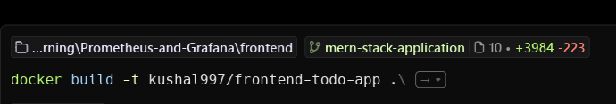
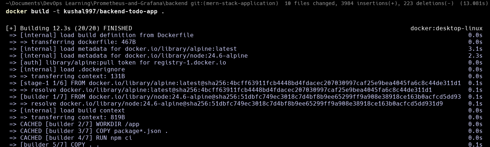
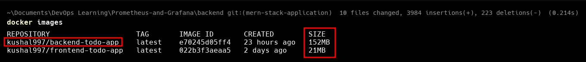
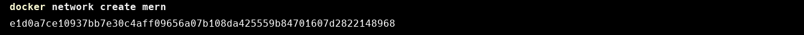
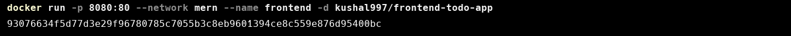
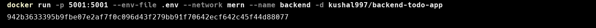
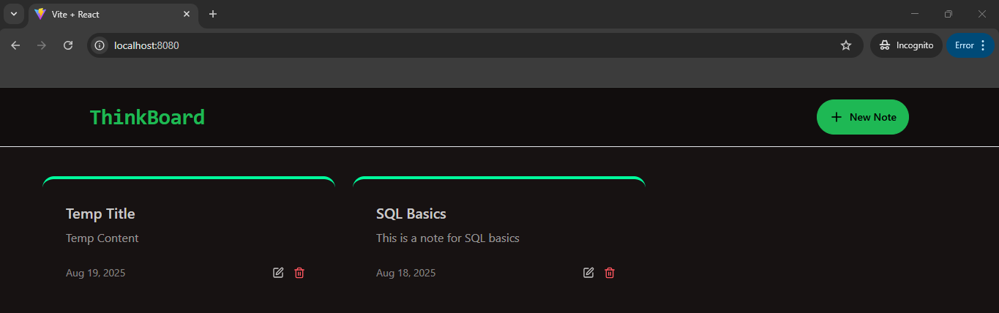

## 🏗️ Building Multi-Stage Docker Images

In this tutorial, we will be creating a multi stage docker image for a MERN application. The code for the MERN application can be found here.

**🚀 Step 1:** Clone the MERN application

`git clone <url>`

**🎨 Step 2:** Create a dockerfile for the frontend. Make sure you have navigated to the frontend directory

```dockerfile
# Build Stage
FROM node:24-alpine3.22 AS build

# Change the current working directory to app
WORKDIR /app

# Copy the package.json and package-lock.json to the app directory

COPY package*.json .

# Install the production dependencies

RUN npm ci --only=production

# Copy the source code from host system to the container

COPY . .

# Bundle the frontend application

RUN npm run build 

# Deployment Stage

FROM nginx:alpine-slim

# Remove the default static files present in this folder

RUN rm -rf /usr/share/nginx/html/*

# Copy the static files from the host system and put it into /usr/share/nginx/html directory for nginx to serve it

COPY --from=build /app/dist /usr/share/nginx/html

# Copy the nginx configuration

COPY nginx.conf  /etc/nginx/conf.d/default.conf

# Tell docker to run the frontend on port 80 

EXPOSE 80

# Serve the frontend application

CMD ["nginx", "-g", "daemon off;"]
```

✨ Highlights:

* Split into build & deploy stages.

* Keeps only static files in the final image (no Node.js runtime).

* Very lightweight since it uses nginx:alpine-slim.

**⚙️ Step 3:** Create a dockerfile for backend. Make sure you have navigated to the backend directory

```dockerfile
# Build Stage
FROM node:24.6-alpine AS builder

# Change the current working directory to app
WORKDIR /app

# Copy the package.json and package-lock.json to the app directory
COPY package*.json .

# Install both development as well as production dependencies
RUN npm ci

# Copy the source code from host system to the container
COPY . .

# Bundle the backend application (esbuild is used for this purpose)
RUN npm run build

# Remove development dependencies (the above command and this one can be combined together as well)
RUN npm prune --production

# Deploy stage
FROM alpine:latest

# Adding nodejs-lts runtime
RUN apk add --no-cache nodejs-lts tini

# Change the current working directory to app
WORKDIR /app

# Copy the node modules that were generated in the build stage into the current working directory
COPY --from=builder /app/node_modules ./node_modules

# Copy the bundled backend application
COPY --from=builder /app/dist ./dist

# Copy the package and package-lock.json in case if dependencies needed to be installed on runtime
COPY --from=builder /app/package*.json ./

# Run tini as the first PID
ENTRYPOINT ["tini","--"]

# Run the backend application
CMD ["node","dist/app.js"]
```

✨ Highlights:

* Uses esbuild to bundle Node.js code → much faster.

* Removes dev dependencies with npm prune --production.

* Runs with tini → prevents zombie processes.

* Final image is just Alpine + Node.js runtime, making it secure & lean.

**📦 Step 4:** Now build the frontend as well as the backend docker images

`docker build -t <DOCKER-USERNAME>/frontend-todo-app:latest .`
`docker build -t <DOCKER-USERNAME>/backend-todo-app:latest .`




**📏 Step 5:** Check the size of images 

`docker images`



✅ Frontend image: 21MB
✅ Backend image: 152MB

👉 Achieved small size because of **multi-stage builds.**

**🌐 Step 6:** Create a docker network so that backend and frontend application are in the same network and are able to communicate with each other easily.

`docker network create mern`



**🖥️ Step 7:** Run the frontend docker image built in step 4

`docker run -p 8080:80 --network mern --name frontend -d frontend-todo-app`



This will run the docker image in the mern network.

**⚡Step 8:** Run the backend docker image built in step 5

`docker run -p 5001:5001 --env-file .env --network mern -d backend-todo-app`



This will run the docker image in the mern network and the container will have the name of backend. To run the backend you will need MongoDB Atlas and Upstash Redis. All the instructions can be found in this repo.

**✅ Step 9:** Test the application

Visit `http://localhost:8080` to test the application

